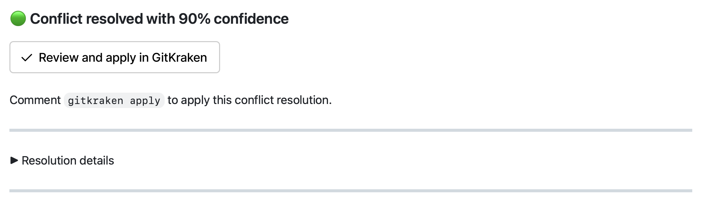

# Merge Mate - Action

A GitHub Action that syncs pull requests with their target branches and uses AI to resolve conflicts.

## Quick Start

Run the **[Setup Wizard](https://gitkraken.dev/merge-mate/setup)**. It walks you through installing the GitHub App, configures your secrets, and opens a PR with the workflow files for each repo you select. Merge that PR and you're ready to go.

When a target branch update causes conflicts, Merge Mate resolves them and posts a PR comment:

<p align="center">
  
</p>

If Merge Mate needs to push to branches in forks (especially private forks), set up fork credentials before you start. You have two options:

- Install the GitKraken App on the fork owner's account and grant it access to the fork.
- Pass `fork-push-token` in both the sync and review workflows.

<details>
<summary>Manual setup</summary>

### Prerequisites

1. **Install the GitHub App** — [Install Merge Mate](https://github.com/apps/gitkraken-services) on your repository. Select "Only select repositories" for least-privilege access. The app appears as **GitKraken Services** on all GitHub UI surfaces.

   > After installing, GitHub redirects to your account settings. Return here to continue setup.

2. **Get an API key** — Go to [Settings](https://gitkraken.dev/mergemate/settings), sign in, and create an API key.

3. **Add the key to GitHub Secrets** — In your repository, go to **Settings → Secrets and variables → Actions → New repository secret**. Name it `MERGE_MATE_API_KEY` and paste the key.

4. **Add workflow files** — Copy from [`templates/`](./templates/) or create the YAML files below manually.

### Workflow Files

Create two workflow files in your repository:

**`.github/workflows/merge-mate.yml`** — syncs all PRs when the target branch is updated:

```yaml
name: Merge Mate Sync
on:
  push:
    branches: [main] # ← replace with your default branch
concurrency:
  group: merge-mate-sync-${{ github.ref }}
  cancel-in-progress: true
permissions:
  contents: write
  pull-requests: write
  id-token: write
jobs:
  sync:
    runs-on: ubuntu-latest
    steps:
      - uses: gitkraken/merge-mate-action/sync@v0.4
        with:
          ai-api-key: ${{ secrets.GK_AI_PROVISIONER_TOKEN }}
```

**`.github/workflows/merge-mate-review.yml`** — handles apply/undo via PR comment buttons or manual trigger:

```yaml
name: Merge Mate Review
on:
  repository_dispatch:
    types: [merge-mate-apply, merge-mate-undo]
  issue_comment:
    types: [created]
  workflow_dispatch:
    inputs:
      pr-number:
        description: "PR number to process"
        required: true
        type: number
      action:
        description: "Action to perform"
        required: true
        type: choice
        options:
          - apply
          - undo
permissions:
  contents: write
  pull-requests: write
  issues: write
  id-token: write
concurrency:
  group: merge-mate-review-${{ github.event.client_payload.pr-number || github.event.issue.number || inputs.pr-number }}
  cancel-in-progress: false
jobs:
  review:
    if: >-
      github.event_name == 'repository_dispatch' ||
      github.event_name == 'workflow_dispatch' ||
      (github.event.issue.pull_request && github.event.sender.type != 'Bot')
    runs-on: ubuntu-latest
    steps:
      - uses: gitkraken/merge-mate-action/review@v0.4
        with:
          pr-number: ${{ inputs.pr-number }}
          action: ${{ inputs.action }}
```

The `repository_dispatch` trigger handles apply/undo button clicks from the diff viewer. `issue_comment` handles `gitkraken apply` / `gitkraken undo` mentions on PRs. `workflow_dispatch` is optional for manual runs from the Actions tab.

These workflows omit `github-token` on purpose and rely on GitKraken App authentication via OIDC, so they require `permissions: id-token: write`. If you prefer to use `${{ github.token }}` or a PAT instead, pass it explicitly as `github-token`.

If your repository receives PRs from private forks, read [Fork Pushes](./README.md#fork-pushes) before relying on the default setup. Installing the app only on the base repository is not always enough to push back to fork branches.

</details>


## Features

- **Flexible Sync** — Rebase (linear history) or Merge (merge commits)
- **AI Conflict Resolution** — Automatic conflict resolution with AI
- **Safe by Default** — AI resolutions stored in hidden refs until approved; clean rebases are applied directly
- **Parallel Processing** — Configurable concurrency
- **Detailed Reports** — PR comments with diffs, GitHub Summary

## How It Works

When the target branch updates, Merge Mate rebases or merges all open pull requests that target that branch.

The outcome depends on the **apply-policy** and **confidence-threshold** settings:

| Apply Policy     | Clean Rebase (no conflicts) | AI-Resolved Conflicts                                                      |
| ---------------- | --------------------------- | -------------------------------------------------------------------------- |
| `auto` (default) | Pushed to PR branch         | Pushed if confidence ≥ threshold, otherwise saved to hidden ref for review |
| `resolved-only`  | Skipped (no push)           | Same as `auto`                                                             |
| `review`         | Skipped (no push)           | Saved to hidden ref for review                                             |
| `dry-run`        | No push, report only        | No push, report only                                                       |

The default **confidence-threshold** is `100`. Merge Mate does not automatically apply changes unless the AI is fully confident.

To allow automatic application of high-confidence resolutions, lower the value (for example, `80`).

When Merge Mate saves a resolution to a hidden ref, it posts a pull request comment with:
- A diff preview
- An **Apply** button

Select **Apply** to trigger the review workflow and push the resolution to the pull request branch.

Select **Undo** to revert the change.

Both actions force-push to the pull request branch. If you have a local checkout, run:

```bash
git fetch && git reset --hard origin/<branch>
```

## Sync Inputs

| Input | Default | Description |
|-------|---------|-------------|
| `github-token` | — | GitHub token for authentication. If omitted, Merge Mate falls back to GitKraken App authentication via OIDC. |
| `fork-push-token` | — | Explicit token used only to probe/push fork branches when the primary token cannot access the fork |
| `mode` | `rebase` | `rebase` or `merge` |
| `signing-mode` | `off` | `off` or `ssh`. Enables SSH signing capability, but Merge Mate only signs when policy requires it |
| `pr-filter` | — | YAML filter for selecting PRs by `ids`, `target-branches`, `labels`, `created`, `updated`, `authors`, or `include-drafts`. The `authors` key supports `@org/team-slug` tokens. |
| `concurrency` | `3` | Maximum number of PRs to process in parallel |
| `apply-policy` | `auto` | `auto` — apply above threshold. `resolved-only` — same but skip clean rebases. `review` — save non-clean results to hidden refs for review and skip clean rebases. `dry-run` — no push |
| `confidence-threshold` | `100` | Minimum AI confidence (0–100) to auto-apply. `100` = only when fully confident |
| `ai-provider` | `none` | AI provider: `none` \| `gitkraken` |
| `ai-model` | — | AI model identifier (provider-specific) |
| `ai-api-key` | — | API key or token for the AI provider |
| `ai-api-base` | — | Custom API base URL |
| `exclude-files` | see below | Newline-separated glob patterns for files to exclude from AI resolution |
| `diff-viewer-base-url` | `https://gitkraken.dev` | Base URL for the diff viewer |
| `telemetry` | `true` | Enable telemetry and error tracking |
| `log-level` | `info` | `error` \| `warn` \| `info` \| `debug` |

## SSH Commit Signing

Set `signing-mode: ssh` when you need Merge Mate to preserve trust signals on rewritten commits.

For the full setup flow, see [SSH_SIGNING.md](./SSH_SIGNING.md).

- Existing signed commits in a PR are preserved by re-signing rewritten commits.
- Branches that require signed commits are handled automatically when the bot can sign.
- If signing is required but the runner cannot sign safely, Merge Mate stores the rebased result in hidden refs and posts manual re-sign instructions instead of exposing the normal apply button.

### Bot Setup

1. Create or reuse the GitHub account that will appear as the committer.
2. Generate a passphrase-less SSH key for signing:

```bash
ssh-keygen -t ed25519 -C "merge-mate[bot]@users.noreply.github.com" -f merge-mate-signing
```

3. Add the public key from `merge-mate-signing.pub` to the bot GitHub account as a **signing key**.
4. Verify that the committer email is a verified email on that same GitHub account.
5. Store the private key as a repository or organization secret.

### Required Environment Variables

Provide signing secrets and committer identity through workflow `env`:

```yaml
jobs:
  sync:
    runs-on: ubuntu-latest
    env:
      MERGE_MATE_SSH_SIGNING_KEY: ${{ secrets.MERGE_MATE_SSH_SIGNING_KEY }}
      MERGE_MATE_GIT_COMMITTER_NAME: merge-mate[bot]
      MERGE_MATE_GIT_COMMITTER_EMAIL: merge-mate[bot]@users.noreply.github.com
    steps:
      - uses: gitkraken/merge-mate-action/sync@v0.4
        with:
          signing-mode: ssh
```

`MERGE_MATE_SSH_SIGNING_KEY` must contain the private key. Merge Mate derives the public key on the runner and uses it only for commit signing. For now, only passphrase-less SSH keys are supported.

### Troubleshooting Unverified Commits

If Merge Mate warns that GitHub did not verify rewritten commits:

- `unknown_key`: upload the SSH public key to the bot account as a signing key.
- `not_signing_key`: remove and re-add the key as a signing key instead of an authentication key.
- `unverified_email`: make `MERGE_MATE_GIT_COMMITTER_EMAIL` match a verified email on the bot account.
- `no_user`: make sure the committer email belongs to a GitHub account.
- `malformed_signature`: re-save the private key secret exactly as exported, including the final newline.

## Review Inputs

| Input | Default | Description |
|-------|---------|-------------|
| `github-token` | — | GitHub token for authentication. If omitted, Merge Mate falls back to GitKraken App authentication via OIDC. |
| `fork-push-token` | — | Explicit token used only to probe/push fork branches when the primary token cannot access the fork |
| `pr-number` | — | PR number to process (manual fallback for `workflow_dispatch`; ignored on `repository_dispatch` and `issue_comment` events) |
| `action` | — | `apply` or `undo` (manual fallback for `workflow_dispatch`; ignored on `repository_dispatch` and `issue_comment` events) |
| `telemetry` | `true` | Enable telemetry and error tracking |
| `log-level` | `info` | `error` \| `warn` \| `info` \| `debug` |

## Fork Pushes

Fork PRs are resolved with a separate pre-push credential flow. This is the part that usually breaks on private forks.

### Why private forks are different

When Merge Mate rewrites a PR branch, it must push back to the repository that owns that branch.

- For same-repo PRs, that is the base repository.
- For fork PRs, that is the fork repository, not the base repository.
- A GitHub App installation token only works on repositories included in that installation.

That means installing the app only on the base repository does not automatically let it push to a private fork owned by another user or organization.

### Credential order

For fork pushes, Merge Mate resolves credentials in this order:

1. If the primary source is a regular `github-token` or PAT, probe that token against the fork repository first.
2. If the primary source is the GitKraken App, request a fork-specific installation token for the fork owner first.
3. If the selected primary path cannot verify fork access, try `fork-push-token`.
4. If none of those paths can verify fork access, do not push the fork branch automatically.

The same credential resolver is used in both `sync` and `review`, so any credential you choose for fork pushes should be available to both workflows.

### Sync vs review

The credential resolver is shared, but the fallback behavior is intentionally different:

- `sync` falls back to hidden refs when it cannot find a valid fork push path, so the PR can still be processed and reviewed.
- `review` does not silently downgrade the apply/undo request; it fails with a precise message when there is no valid way to push the fork branch.
- If a fork push was already rejected after access was verified, the PR comment suppresses the interactive apply button and leaves manual commands instead of offering the same retry again.

### Recommended solutions

- If your primary `github-token` or PAT already has direct access to the fork repository, Merge Mate can use that token directly and you may not need extra fork-specific credentials.
- Preferred path: install the GitKraken App on the account or organization that owns the fork and grant it access to that fork repository.
- Explicit fallback: provide `fork-push-token` with access to the fork branch. This is the most predictable option when you cannot install the app on the fork owner.
- Opportunistic option: `${{ github.token }}` can be passed as `fork-push-token`, but GitHub documents `GITHUB_TOKEN` as scoped to the workflow repository, so this is best-effort rather than a guaranteed solution for private forks.

If the fork is user-owned, enabling "Allow edits from maintainers" can help in some setups, but it does not grant a GitHub App installation token access to a private fork by itself.

If you use `${{ github.token }}` as `fork-push-token`, the workflow still needs `permissions: contents: write`.

### Failure modes and what they mean

- App not installed on the fork owner: Merge Mate cannot mint a fork installation token, so it falls back to `fork-push-token` if provided.
- `fork-push-token` missing or invalid: Merge Mate keeps the rebased result in hidden refs and posts manual commands instead of pushing the branch.
- Probe inconclusive, for example rate limits or transient network failures: Merge Mate treats that as uncertain access and avoids claiming the fork is definitely unreachable.
- Push rejected after access was verified: this usually means branch protection, repository rules, or token capabilities still block the final push. In that case the PR comment disables the interactive apply retry and shows manual commands instead.

### Operational guidance

- If you choose `fork-push-token`, use the same secret in both the sync and review workflows.
- If you use a PAT, it needs access to the fork repository and permission to update the source branch.
- If you use `${{ github.token }}` as `fork-push-token`, treat it as a convenience fallback, not as the primary solution for private forks.
- If your reviewers depend on the button-based apply flow, prefer installing the app on the fork owner or providing a reliable `fork-push-token`; otherwise the branch may stay in hidden refs and require manual apply.

## Excluding Files from AI Resolution

By default, Merge Mate excludes lock files, minified bundles, generated code, and build artifacts from AI resolution.

For conflicted lock files, Merge Mate uses the target branch version.

Custom patterns are **appended** to the defaults:

```yaml
- uses: gitkraken/merge-mate-action/sync@v0.4
  with:
    exclude-files: |
      **/vendor/**
      **/fixtures/**
```

## Permissions

| Permission             | Why                                              |
| ---------------------- | ------------------------------------------------ |
| `contents: write`      | Push rebased branches and hidden refs            |
| `pull-requests: write` | Post and update PR comments                      |
| `issues: write`        | Add reactions to PR comments (mention feedback)  |
| `id-token: write`      | Request OIDC tokens for GitKraken services (GitHub App auth fallback and GitKraken AI) |

`id-token: write` is required whenever you omit `github-token`, and also when using `ai-provider: gitkraken`. If you provide `github-token` explicitly and do not use GitKraken AI, you can omit it.

## More Examples

Copy-ready workflow templates are in [`templates/`](./templates/) — pick a trigger pattern, replace placeholders, commit to `.github/workflows/`. See [`templates/manifest.json`](./templates/manifest.json) for the full list with configurable options.

See [EXAMPLES.md](./EXAMPLES.md) for configuration recipes: apply policies, SSH signing, fork push workflows, PR filtering, and more.

## Known Limitations

- **Committer identity** — All commits pushed by Merge Mate show `gitkraken-services[bot]` as the committer. The original author is preserved.
- **Commit signatures** — Rewritten commits lose their original signatures. If your branch protection requires signed commits, you may need to re-sign after apply.
- **Force push** — Apply, undo, and direct sync all force-push to the PR branch. Coordinate with co-authors before applying if they have local commits not yet pushed on the same branch.
- **Private forks** — The GitHub App must be installed on each fork individually. Installing it only on the base repository is not enough to push to fork branches.

## Troubleshooting

**"APIKey is required"** — The secret is missing or misconfigured. Verify that `MERGE_MATE_API_KEY` exists in Settings → Secrets and variables → Actions, the name matches exactly (case-sensitive), and the token is valid.

**"No PRs processed"** — Check that the `branches` trigger in your workflow matches the branch that was actually pushed. If you use `pr-filter`, verify the filter does not exclude all open PRs. Draft PRs are excluded by default; set `include-drafts: true` in `pr-filter` to include them (needed for stacked-PR workflows where a draft sits mid-chain).

**Permission errors on push** — Ensure `contents: write` is set in the workflow `permissions` block. Repository-level settings (Settings → Actions → General → Workflow permissions) must also allow write access.

**Apply/Undo button does nothing** — The review workflow must be set up separately (see Quick Start). Check that `.github/workflows/merge-mate-review.yml` exists with `repository_dispatch: types: [merge-mate-apply, merge-mate-undo]` and `issue_comment: types: [created]` triggers.

**Mention command does nothing** — Verify the review workflow has `issue_comment: types: [created]` in its triggers. The comment must be on a PR (not an issue) and the author must have write access to the repository.

## Cleanup

Over time, hidden refs (`refs/merge-mate/*`) accumulate in your repository. To clean them up, add a scheduled workflow:

> [!WARNING]
> This deletes all merge-mate refs including pending resolutions awaiting review.
> Any unapplied AI conflict resolutions will be lost.

```yaml
name: Merge Mate Cleanup
on:
  schedule:
    - cron: "0 3 * * 0" # weekly on Sunday at 3am UTC
  workflow_dispatch:
permissions:
  contents: write
jobs:
  cleanup:
    runs-on: ubuntu-latest
    steps:
      - uses: actions/checkout@v4
      - name: Delete stale merge-mate refs
        run: |
          git ls-remote origin 'refs/merge-mate/*' | awk '{print $2}' | while read ref; do
            git push origin --delete "$ref" 2>/dev/null || true
          done
```

This deletes all hidden refs. Applied or undone resolutions are already on the PR branch, so removing the refs is safe.

## Versioning

**For v0.x.y (pre-release):**

- Pin to `@v0.4` — receives patches within the same minor version
- Breaking changes may occur between minors

**For v1+ (stable):**

- Pin to `@v1` — all compatible updates
